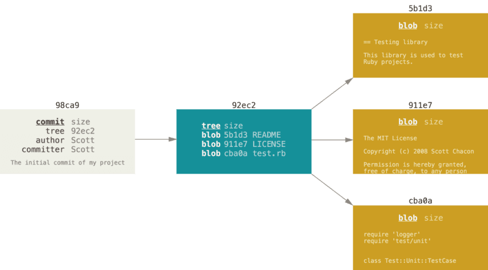

# Git学习小记之分支原理

如果想要熟练使用 Git，没有分支理念是绝对行不通的，在用 Git 管理项目的时候，经常需要使用 commit 这个命令，那么这个 commit 到底是指什么呢？

按照官方的解释，这应该成为一个对象，它包含着一个指向暂存内容(被add的文件)快照的指针，包含本次提交的附属信息，比如说作者等等，指向父 commit 对象(如果被 merge 而成，可能有多个父 commit 对象)的指针。

举下面这个例子来分析：

```bash
git add README test.rb LICENSE
git commit -m 'initial commit of my project'
```

- add：暂存操作会对文件计算校验和(SHA-1哈希字串)，然后与当前版本的文件快照(用 blob 对象存储)一起存入到暂存区域中。
- commit：正式建立提交对象前：Git 先计算出每一个子目录的校验和，然后在 Git 仓库中，将这些目录保存为树对象。

建立提交对象的过程主要如下：
携带相关提交信息，包含一个指向该树的指针，这样就代表如果将来需要，可以重现此次快照内容。
来看看现在仓库中有什么：
一个表示文件快照内容的 blob 对象，一个记录着目录树内容，以及其中各个文件具体对应哪个 blob 对象的索引 tree 对象。以及一个包含着指向索引 tree 对象，以及其他提交信息元数据的 commit 对象。如图：


